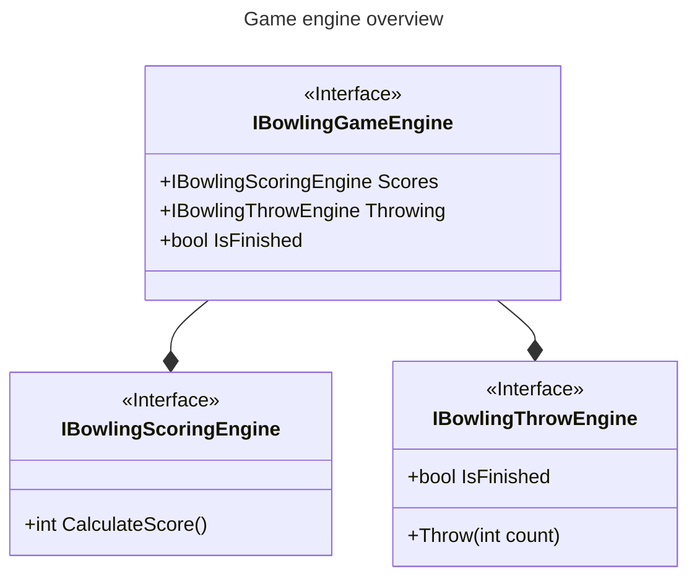

# Bowling Code Kata

This Bowling Code Kata is designed to practice and improve your coding skills by implementing a bowling scoring system.

## Description

The goal of this kata is to create a program that calculates the score of a bowling game based on the rolls of a player. The rules for scoring in bowling can be found [Wikipedia Traditional scoring](https://en.wikipedia.org/wiki/Ten-pin_bowling#Traditional_scoring). Your task is to write a function or set of functions that take in a series of rolls and output the total score for the game.

### Instructions
- Write a class `Game` with following abstract methods
    - A method for roll pins
    - A method for calculating score

## Implementation



The game engine class
```csharp
/// <summary>
/// Definition of a bowling game engine
/// </summary>
public interface IBowlingGameEngine
{
    /// <summary>
    /// Information about the current score
    /// </summary>
    IBowlingScoringEngine Scores { get; }

    /// <summary>
    /// Information about the current throwing 
    /// </summary>
    IBowlingThrowEngine Throwing { get; }

    /// <summary>
    /// True when the game has been finished.
    /// </summary>
    bool IsFinished { get; }
}
```
Source: [IBowlingGameEngine.cs](src/Bowling-Game-Engine/BowlingGame/IBowlingGameEngine.cs)<br>
Implementation: [BowlingGameEngine.cs](src/Bowling-Game-Engine/BowlingGame/Impl/BowlingGameEngine.cs)

The throwing engine class
```csharp
/// <summary>
/// Definition for throwing pins for a bowling game
/// </summary>
public interface IBowlingThrowEngine
{
    /// <summary>
    /// Throws the given count of pins
    /// </summary>
    /// <exception cref="BowlingException">Thrown when the game has been finished.</exception>
    void Throw(int count);

    /// <summary>
    /// Returns true if the game has been finished.
    /// </summary>
    bool IsFinished { get; }
}
```
Source: [IBowlingThrowEngine.cs](src/Bowling-Game-Engine/BowlingGame/IBowlingThrowEngine.cs)<br>
Implementation: [BowlingThrowEngine.cs](src/Bowling-Game-Engine/BowlingGame/Impl/BowlingThrowEngine.cs)

The scoring engine class
```csharp
/// <summary>
/// Definition for calculating score for a bowling game
/// </summary>
public interface IBowlingScoringEngine
{
    /// <summary>
    /// Calculates the current score
    /// </summary>
    int CalculateScore();
}
```
Source: [IBowlingThrowEngine.cs](src/Bowling-Game-Engine/BowlingGame/IBowlingScoringEngine.cs)<br>
Implementation: [BowlingThrowEngine.cs](src/Bowling-Game-Engine/BowlingGame/Impl/BowlingScoreEngine.cs)

## Design / Implementation decisions
- Single Responsibility (SRP) / Seperation of Concerns
- Test driven development
- Clean Code principles

## How to test

```bash
git pull
cd src
docker compose up --force-recreate --build test-runner
```

the output should be

```
src-test-runner-1  | Starting test execution, please wait...
src-test-runner-1  | A total of 1 test files matched the specified pattern.
src-test-runner-1  |
src-test-runner-1  | Passed!  - Failed:     0, Passed:   110, Skipped:     0, Total:   110, Duration: 68 ms - Bowling-Game-Engine.Tests.dll (net8.0)
src-test-runner-1 exited with code 0
```

## Ressources
- [Ten-pin bowling](https://en.wikipedia.org/wiki/Ten-pin_bowling)
- [The Bowling Game Kata (Uncle Bob)](http://butunclebob.com/ArticleS.UncleBob.TheBowlingGameKata)